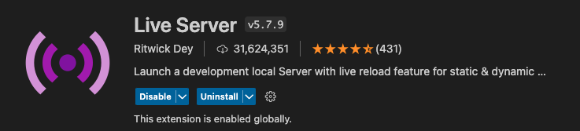
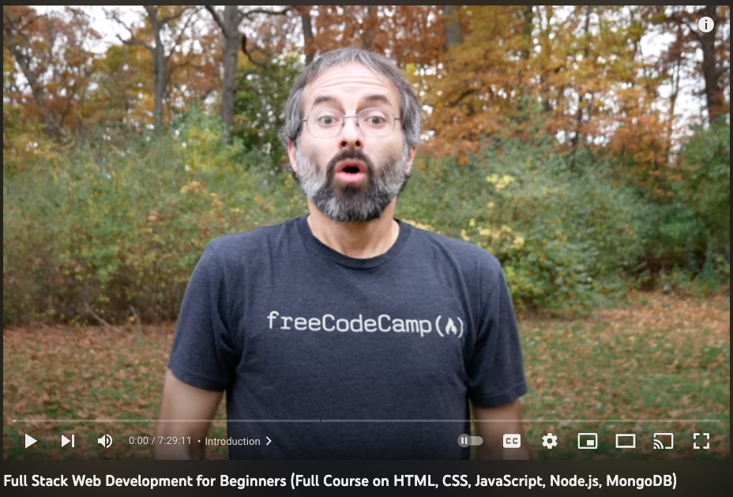

# Frontend Block 01
## Overview

**Welcome to CD Intro to HTML/CSS/JavaScript(vanilla)**, in this unit you will either be introduced or refreshed on the basics of using HTML , CSS, and JavaScript.

### Before you begin

To do our frontend development we will be using the IDE Visual Studio code. Please make sure that it is installed on your development device, before you continue.

Inside of visual studio code, we need to add the extention **Live Server**.

Here are step-by-step instructions to install the Live Server extension in Visual Studio Code:

1. Open Visual Studio Code on your computer. If you haven't installed it yet, you can download it for free from the Visual Studio Code website.
2. Click on the **Extensions** icon in the left-hand sidebar of Visual Studio Code. It looks like a square puzzle piece.
3. In the **Extensions Marketplace** search bar, type "Live Server" and hit enter.
4. You should see the "Live Server" extension in the search results. Click on the "Install" button located to the right of the extension's name.
5. Wait for the extension to download and install. This may take a few seconds to a few minutes depending on the size of the extension.
6. Once the extension is installed, you may need to reload Visual Studio Code for the changes to take effect. You can do this by clicking on the "Reload" button that appears next to the extension in the Extensions panel.
7. To confirm that the extension has been installed, you can check the list of installed extensions. Click on the "Extensions" icon again and look for "Live Server" under the "Installed" tab.

That's it! You have successfully installed the Live Server extension in Visual Studio Code. To use it, simply open an HTML file and click on the "Go Live" button at the bottom right corner of the editor window. The Live Server will launch a local web server and open your HTML file in a browser, allowing you to see your changes in real time.

## Part 01

In this current project which you should have at this time cloned locally on your device, there is a folder called **part01**, that containes the following files:

* index.html

You will be watching and following along with the video below from FreeCodeCamp:

[Full Stack Web Development for Beginners](https://www.youtube.com/watch?v=nu_pCVPKzTk&t=28s)

In the video the instructions guide to coding in the browser using Repl.it, however you will be following along by writing your code in visual studio code.

>The reason for this, is so that when you complete a unit, you can push your changes up to github, and your Team Leads can track your progress.

